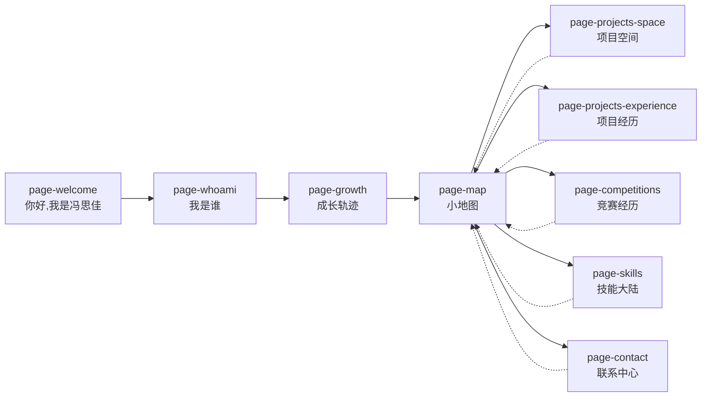

# Website Flowchart - 冯思佳个人网站

> **最后更新：** 2026-06-02
> **版本：** v2.0
> **状态:** 已实现

---

## 页面流程总览

**说明:** 分支页面通过"返回地图"按钮返回小地图

---

## 页面详情

### 线性导航页面 (◀ ▶ 箭头)

| 页面ID | 名称 | 左箭头 | 右箭头 | 说明 |
|--------|------|--------|--------|------|
| page-welcome | 你好，我是冯思佳 | disabled | enabled | 首页入口 |
| page-whoami | 我是谁 | enabled | enabled | 个人介绍 |
| page-growth | 成长轨迹 | enabled | enabled | 点击公司显示详情弹窗 |
| page-map | 小地图 | enabled | **隐藏** | RPG风格地图枢纽 |

### 分支页面 (返回地图按钮)

| 页面ID | 名称 | 返回按钮 | 说明 |
|--------|------|----------|------|
| page-projects-space | 项目空间 | [返回地图] | 项目展示 |
| page-projects-experience | 项目经历 | [返回地图] | 项目详情 |
| page-competitions | 竞赛经历 | [返回地图] | 比赛荣誉 |
| page-skills | 技能大陆 | [返回地图] | 技能展示 |
| page-contact | 联系中心 | [返回地图] | 联系方式 |

---

## 导航规则

### 箭头导航
- **page-welcome**: 左箭头禁用，右箭头可用
- **page-whoami**: 左右箭头都可用
- **page-growth**: 左右箭头都可用
- **page-map**: 左箭头可用，右箭头**隐藏**
- **分支页面 (4-8)**: 无箭头导航，仅通过"返回地图"按钮

### 返回按钮
- 分支页面显示 "◀ 返回地图" 按钮
- 点击后返回 page-map

---

## 交互说明

### 成长轨迹 (page-growth)
- **触发**: 点击公司节点
- **行为**: 显示详情弹窗（淡入动画，300ms）
- **关闭**: 点击弹窗外部区域

### 小地图 (page-map)
- **触发**: 点击地图上的位置卡片
- **行为**: 跳转到对应分支页面
- **返回**: 点击左箭头 ◀ 返回成长轨迹

---

## 已删除页面

| 页面ID | 删除原因 |
|--------|----------|
| ~~page-experience~~ | 改为成长轨迹内的弹窗展示 |

---

## 实现状态

| 功能 | 状态 | 提交 |
|------|------|------|
| 删除 page-experience | ✅ 已完成 | 4fb127d |
| 小地图隐藏右箭头 | ✅ 已完成 | 1a4070a |
| 分支页面添加返回按钮 | ✅ 已完成 | - |
| 成长轨迹公司详情弹窗 | ✅ 已完成 | 2cc883b |

---

## 更新日志

| 日期 | 版本 | 更新内容 |
|------|------|----------|
| 2026-06-02 | v2.0 | 删除 page-experience，添加公司详情弹窗，调整导航结构 |
| 2026-06-02 | v1.0 | 初始版本 |

---

*本文档由 Claude Code 管理 - 实时更新*
